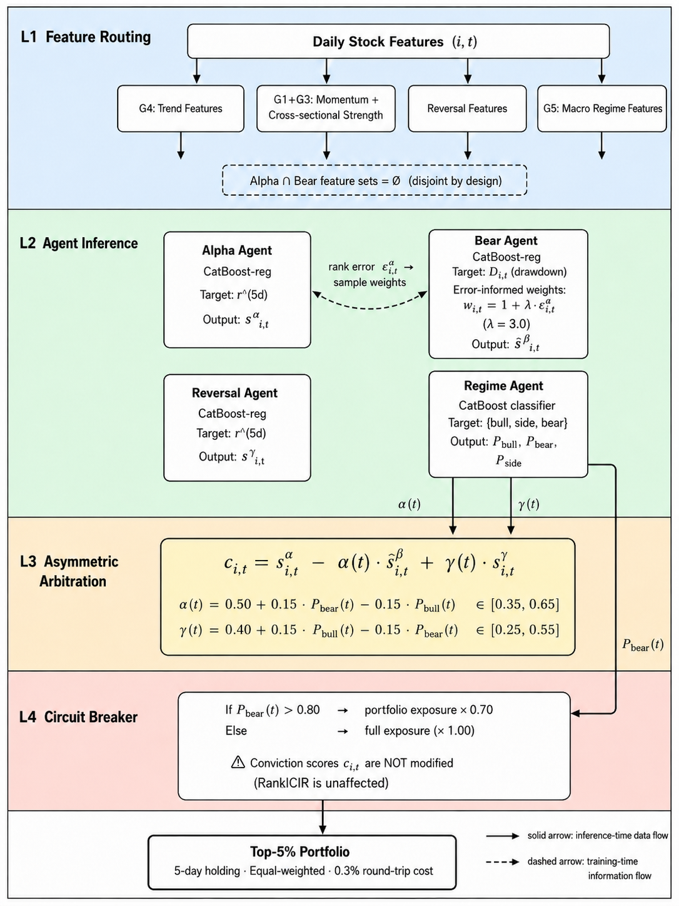
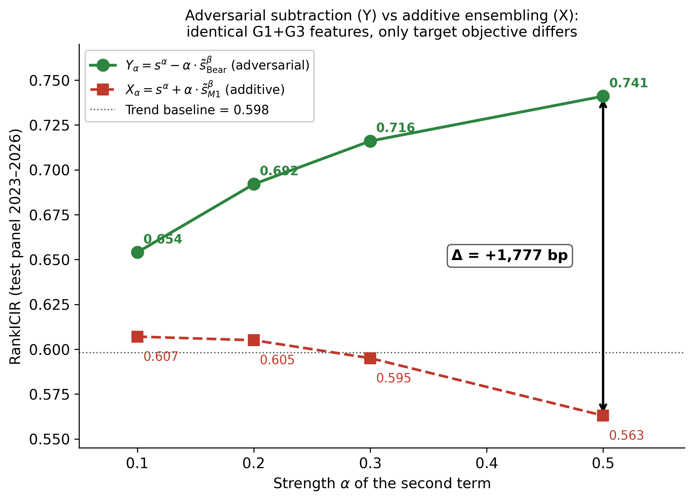
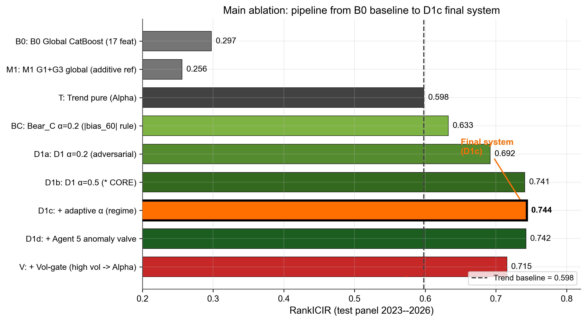
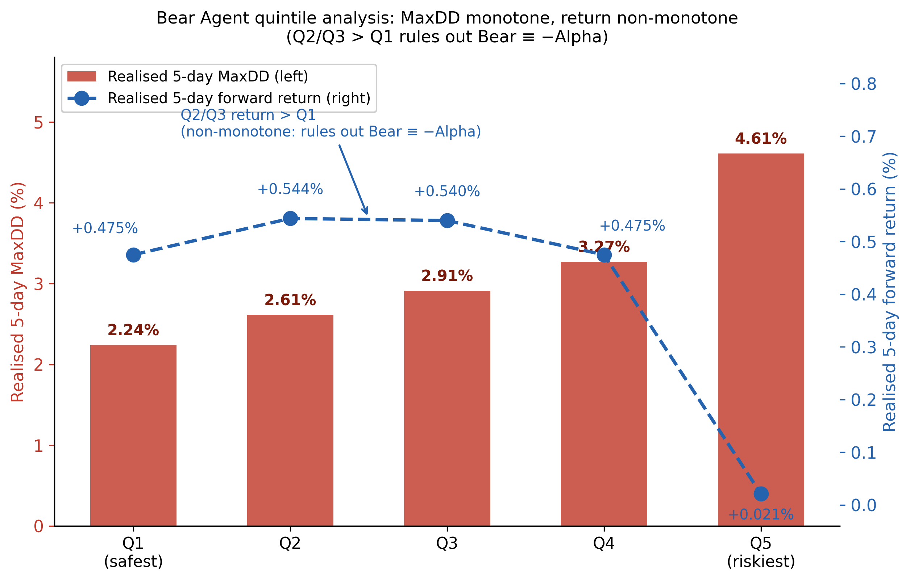
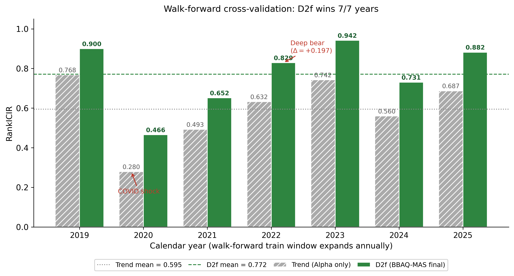
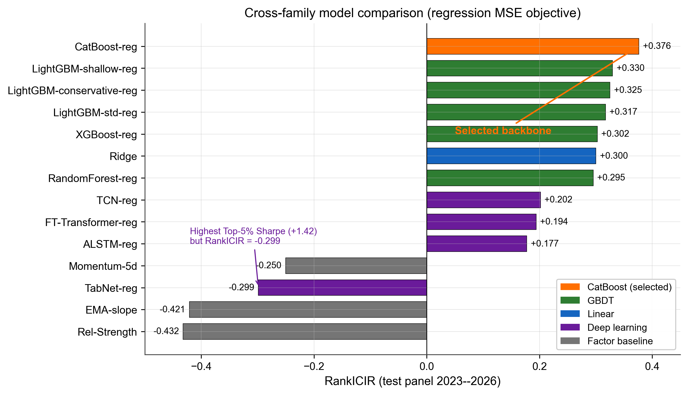
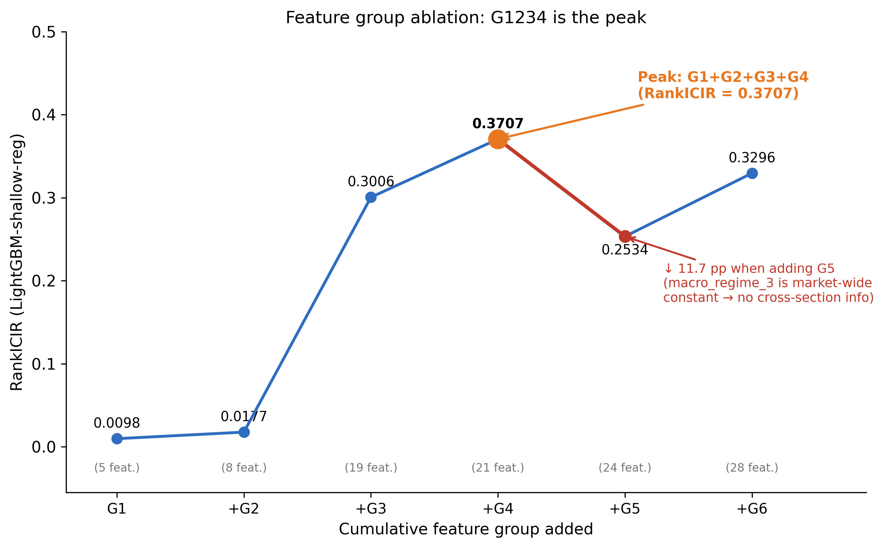
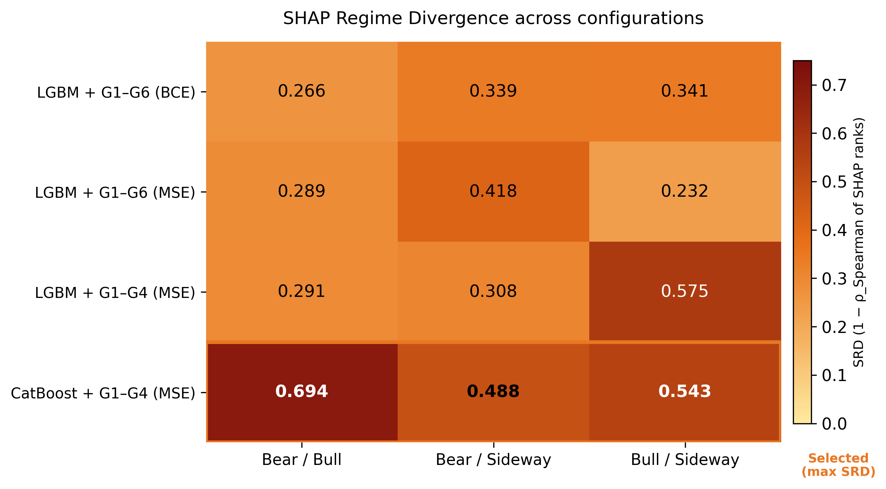

# BBAQ-MAS: Target-Asymmetric Multi-Specialist Learning for A-Share Stock Ranking

Code and experimental artefacts for the paper:

> **BBAQ-MAS: Target-Asymmetric Multi-Specialist Learning for Risk-Aware Cross-Sectional Stock Ranking**

The project studies daily cross-sectional ranking in Chinese A-share markets. BBAQ-MAS separates the task into deterministic specialist learners: an **Alpha specialist** for five-day relative return, a **Bear specialist** for entry-based downside path risk, a **Reversal specialist** for short-horizon mean reversion, and a deterministic **Regime Controller** that adjusts specialist weights. A separate portfolio-level exposure controller improves risk control without changing the stock ranking.

**Universe:** 3,876 A-share stocks  
**Raw panel:** 2016-10-17 to 2026-01-19  
**Test period:** January 2023 to January 2026, 733 trading days  
**Trading setup:** Top-5% long-only ranking, five-day overlapping hold, 0.30% round-trip cost

---

## 1. Headline Results

| Configuration | RankICIR | Top-5% Sharpe | Top-5% MaxDD | AnnRet |
|---|---:|---:|---:|---:|
| B0 - Global CatBoost reference | 0.2974 | +0.920 | -42.84% | -- |
| Trend-SA - Alpha specialist only | 0.5979 | +1.694 | -34.20% | -- |
| D1c - Adaptive Bear coefficient | 0.7438 | +1.829 | -33.28% | +25.62% |
| D2c - Error-informed Bear, lambda=3.0 | 0.7505 | +1.809 | -33.53% | +24.77% |
| **D2f - Reversal specialist + adaptive gamma** | **0.8094** | +1.675 | -33.83% | +23.54% |
| **D2f + portfolio circuit breaker** | **0.8094** | **+1.894** | **-27.27%** | +21.26% |

Walk-forward validation over 2019-2025 shows a **7/7 year win rate** for D2f over the Alpha-only Trend baseline. Stratified bootstrap testing over the 733-day test period gives p < 0.001 for the main RankICIR improvements.

The primary canonical ranking configuration uses `lambda=3.0`, `gamma_0=0.40`, and `delta=0.15`, reaching RankICIR 0.8094. The validation-best configuration (`gamma_0=0.50`, `delta=0.05`) reaches 0.8011. An **ex post test-grid upper bound** reaches 0.8097 and is reported only as a sensitivity reference, not as a model-selection result.

---

## 2. System Architecture



The final conviction score for stock `i` on trading day `t` is

```text
c(i,t) = s_alpha(i,t) - alpha(t) * s_bear(i,t) + gamma(t) * s_reversal(i,t)
```

Specialist scores are standardised cross-sectionally within each trading day before combination. The Bear score enters subtractively because it estimates downside path risk rather than expected return.

### Final specialist inputs

| Module | Input type | Variables | Count |
|---|---|---|---:|
| Alpha specialist | Trend | `ma60_slope`, `ema180_slope`, `bias_60`, `bias_60_vr`, `ma180_slope` | 5 |
| Bear specialist | Momentum, trend-risk, strength | `ret_1d`, `ret_3d`, `ret_5d`, `roc_20`, `ema30_slope_vr`, `board_rank_20d_pct`, `board_rs_20d`, `ret_1d_minus_5d` | 8 |
| Reversal specialist | Short-horizon reversal | `ret_1d`, `ret_3d`, `rev_ret_2d`, `rev_ret_3d_minus_1d`, `rev_zscore_1d`, `rev_mkt_excess_1d` | 6 |
| Regime Controller | Market-state label | `macro_regime_3` | 1 |

### Regime-conditioned coefficients

The Regime Controller is deterministic. It maps `macro_regime_3` into one-hot market-state indicators:

```text
I_bull(t), I_side(t), I_bear(t)
```

and sets

```text
alpha(t) = 0.50 + 0.15 * I_bear(t) - 0.15 * I_bull(t)    in [0.35, 0.65]
gamma(t) = 0.40 + 0.15 * I_bull(t) - 0.15 * I_bear(t)    in [0.25, 0.55]
```

There is no trained probabilistic Regime classifier in the final implementation; the final ranking uses only deterministic regime indicators.

### Portfolio-level circuit breaker

The circuit breaker changes portfolio exposure only. It does not change RankICIR because it does not change the cross-sectional conviction score:

```text
exposure(t) = 0.70  if bear regime or crash condition
            = 1.00  otherwise
```

In the 2023-2026 test period, this overlay preserves RankICIR at 0.8094, improves Sharpe from 1.679 to 1.894, and reduces maximum drawdown from -33.83% to -27.27%.

---

## 3. Bear Target: Entry-Based Adverse Cumulative Loss

The Bear specialist is not trained on peak-to-trough maximum drawdown. It is trained on maximum adverse cumulative loss from the entry day over the five-day holding window.

Let `CG[i,t]` be the cumulative wealth index of stock `i`. For a position opened on day `t`,

```text
R(i,t:j) = CG[i,t+j] / CG[i,t] - 1,      j = 1,...,5
D(i,t)   = max(0, - min_j R(i,t:j))
```

This target records the worst cumulative loss relative to the entry day. It is one-sided and path-sensitive relative to entry, but it is not a true peak-reset maximum drawdown inside the holding window.

Bear sample weights are derived from fitted Alpha rank errors on the training period:

```text
w(i,t) = 1 + lambda * epsilon_alpha(i,t)
```

The adopted value is `lambda=3.0`.

---

## 4. Mechanism Test: Target Asymmetry, Not Feature Addition



The mechanism test holds the Bear-side feature set fixed and changes only the training target and aggregation sign.

| alpha | X = Trend + alpha * M1 | Y = Trend - alpha * D1 | Delta |
|---:|---:|---:|---:|
| 0.1 | 0.6068 | 0.6541 | +473 bp |
| 0.2 | 0.6047 | 0.6918 | +871 bp |
| 0.3 | 0.5948 | 0.7162 | +1,215 bp |
| 0.5 | 0.5631 | 0.7408 | +1,777 bp |

The additive return-trained component deteriorates as its weight increases. The adverse-loss-trained subtractive component improves monotonically. This supports the paper's central claim: the gain comes from target-asymmetric specialist design and signed arbitration, not from simply adding another feature block.

---

## 5. Main Ablation



| Code | Configuration | RankICIR | Sharpe | MaxDD |
|---|---|---:|---:|---:|
| B0 | Global CatBoost reference | 0.2974 | +0.920 | -42.84% |
| M1 | Bear-feature additive return ensemble | 0.2560 | +0.746 | -42.24% |
| T | Trend-SA, Alpha specialist only | 0.5979 | +1.694 | -34.20% |
| BC | `|bias_60|` rule Bear, alpha=0.2 | 0.6325 | +1.750 | -33.33% |
| D1a | Trained Bear specialist, alpha=0.2 | 0.6918 | +1.753 | -33.72% |
| D1b | Trained Bear specialist, alpha=0.5 | 0.7408 | +1.802 | -33.52% |
| D1c | Adaptive alpha from Regime Controller | 0.7438 | +1.829 | -33.28% |
| D2c | Error-informed Bear training, lambda=3.0 | 0.7505 | +1.809 | -33.53% |
| D2f | Reversal specialist + adaptive gamma | 0.8094 | +1.675 | -33.83% |
| **D2f + circuit breaker** | Portfolio-level exposure control | **0.8094** | **+1.894** | **-27.27%** |

---

## 6. Specialist Diagnostics

### Bear quintile diagnostic



| Quintile | n | Mean Bear score | Entry-loss 5d (%) | r_future_5 (%) |
|---|---:|---:|---:|---:|
| Q1, safest | 563,172 | -0.235 | 2.24 | +0.475 |
| Q2 | 563,445 | -0.149 | 2.61 | +0.544 |
| Q3 | 563,444 | -0.072 | 2.91 | +0.540 |
| Q4 | 563,445 | +0.046 | 3.27 | +0.475 |
| Q5, riskiest | 563,724 | +0.421 | 4.61 | +0.021 |
| Q5 - Q1 gap | -- | -- | +2.37 | -- |

Entry-based adverse loss increases monotonically from Q1 to Q5, while realised five-day return is non-monotone. This supports the interpretation that the Bear specialist is not just a sign-flipped return predictor.

### Reversal diagnostic

The Reversal specialist has standalone RankICIR 0.3215. Its score correlation is +0.134 with Alpha and -0.036 with Bear. Adding Reversal to D2c increases RankICIR from 0.7505 to 0.8094, a gain of 589 bp.

---

## 7. Walk-Forward Validation



| Year | Trend | D1c | D2c | D2f | D2f Sharpe |
|---|---:|---:|---:|---:|---:|
| 2019 | 0.768 | 0.806 | 0.751 | 0.900 | +2.509 |
| 2020 | 0.280 | 0.350 | 0.354 | 0.466 | +1.264 |
| 2021 | 0.493 | 0.542 | 0.557 | 0.652 | +3.365 |
| 2022 | 0.632 | 0.786 | 0.793 | 0.829 | -0.066 |
| 2023 | 0.742 | 0.869 | 0.848 | 0.942 | -0.419 |
| 2024 | 0.560 | 0.709 | 0.720 | 0.731 | +0.997 |
| 2025 | 0.687 | 0.757 | 0.759 | 0.882 | +5.218 |
| Mean | 0.595 | 0.688 | 0.683 | 0.772 | +1.838 |

The 2022 row is interpreted cautiously because that year is also used for coefficient and circuit-breaker calibration.

---

## 8. Backbone And Feature-Routing Evidence



CatBoost regression is selected as the shared tabular backbone. In the full model comparison, CatBoost-reg reaches RankICIR 0.3763 and outperforms LightGBM-shallow-reg by 4.7 percentage points.


MSE regression improves RankICIR for ten of eleven evaluated machine-learning models relative to BCE classification.



The preliminary 28-variable G1-G6 registry is used for model-selection and feature-ablation experiments. The final system uses the routed specialist inputs listed above, not the full registry as a single stock-level predictor.



SHAP Regime Divergence is used as supporting evidence that candidate models can rely on different feature subsets across regimes. Regime information is used in the final system through the deterministic Regime Controller.

---

## 9. Repository Structure

```text
.
├── README.md
├── requirements.txt
├── config.py
├── waves_agent.py                         # legacy filename: Elliott Wave experiment
├── bull_bear/
│   ├── config_bb.py
│   ├── src/                               # targets, feature engineering, metrics
│   ├── experiments/                       # step1-step20 experiment scripts
│   ├── results/                           # CSV outputs and trained model files
│   └── delivery/                          # curated reproduction package
├── figure/                                # paper figures
├── results/                               # model-selection and SHAP artefacts
├── src/                                   # shared utilities and model zoo
├── experiments/                           # model-selection driver scripts
└── scripts/                               # figure and delivery-package builders
```

Some source files and experiment scripts retain legacy names such as `agent4` or `waves_agent.py`; these are filenames, not paper terminology.

---

## 10. Reproduction

### Read-only review

The compiled paper and numerical artefacts are pre-built in `bull_bear/delivery/`:

```text
bull_bear/delivery/paper/
bull_bear/delivery/results/
bull_bear/delivery/models/
```

### Full reproduction

```bash
pip install -r requirements.txt

# Place a compatible A-share panel dataset at the path configured in config.py.
# Required schema is documented in src/features.py.

python -m bull_bear.experiments.step12_d2f_final
python -m bull_bear.experiments.step15_d1c_vs_d2f
python -m bull_bear.experiments.step16_agent4_practical
python -m bull_bear.experiments.step17_leakage_robustness
python -m bull_bear.experiments.step20_holding_period
```

### Regenerate figures

```bash
python scripts/make_paper_figures_v2.py
python scripts/make_experiments_figures.py
python scripts/make_paper_figures.py
```

### Rebuild delivery package

```bash
python scripts/build_delivery.py
```

---

## 11. Data

| Item | Value |
|---|---|
| Universe | 3,876 A-share stocks |
| Raw daily panel | 2016-10-17 to 2026-01-19 |
| Panel size | Approximately 7.17 million stock-day observations |
| Forward return target | `r_future_5 = prod_{k=1..5}(1 + ret_1d[t+k]) - 1` |
| Training split | 2016-2021 |
| Validation split | 2022, scalar calibration only |
| Test split | January 2023 to January 2026, 733 trading days |
| Walk-forward | 2019-2025 |

The underlying A-share market data is not redistributed because of commercial-licensing restrictions. The schema is documented in `src/features.py` so compatible datasets can be substituted.

---

## 12. Key Output Files

| File | Purpose |
|---|---|
| `bull_bear/delivery/results/ablation/final_ablation.csv` | Main ablation chain |
| `bull_bear/delivery/results/ablation/mechanism_validation.csv` | Target-asymmetry mechanism test |
| `bull_bear/delivery/results/ablation/step8_d2_peak.csv` | Error-weighting lambda grid |
| `bull_bear/delivery/results/ablation/step12_gamma_peak.csv` | Adaptive gamma grid |
| `bull_bear/delivery/results/validation/step15_walkforward_d1c_vs_d2f.csv` | Walk-forward validation |
| `bull_bear/delivery/results/validation/bootstrap_test.csv` | Bootstrap significance analysis |
| `bull_bear/delivery/results/validation/bear_quintile_analysis.csv` | Bear specialist diagnostic |
| `bull_bear/delivery/results/ablation/step16_agent4_practical.csv` | Portfolio circuit-breaker variants |
| `bull_bear/delivery/results/robustness/step17_*.csv` | Parameter sensitivity |
| `bull_bear/delivery/results/robustness/step20_*.csv` | Holding-period analysis |

---

## 13. License

The code in this repository is released under the MIT License.

The underlying A-share market data is not redistributed here due to commercial licensing restrictions.
