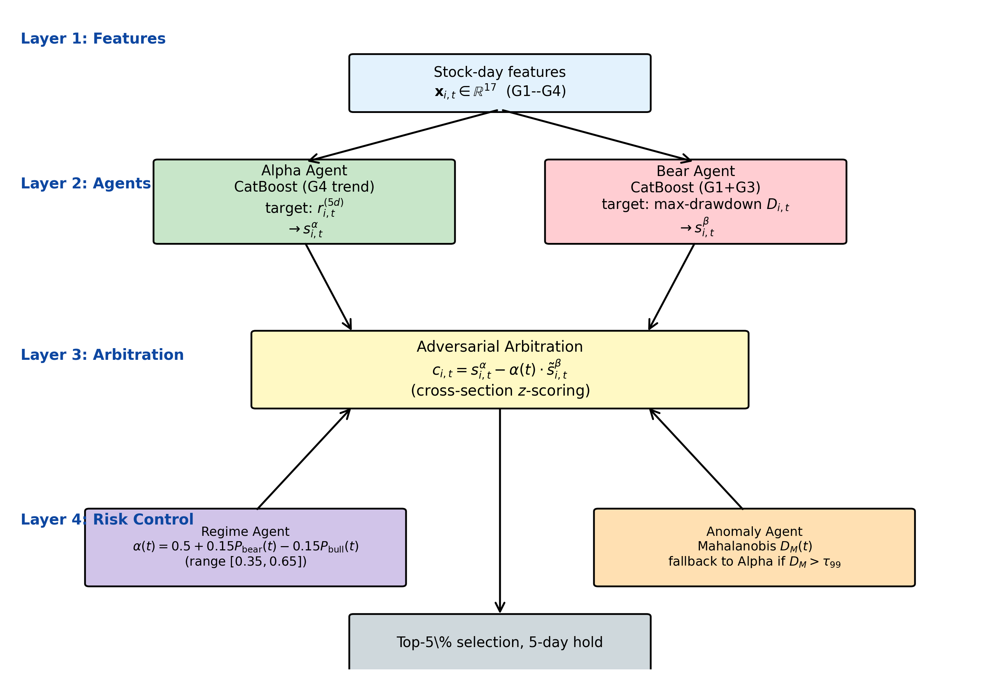
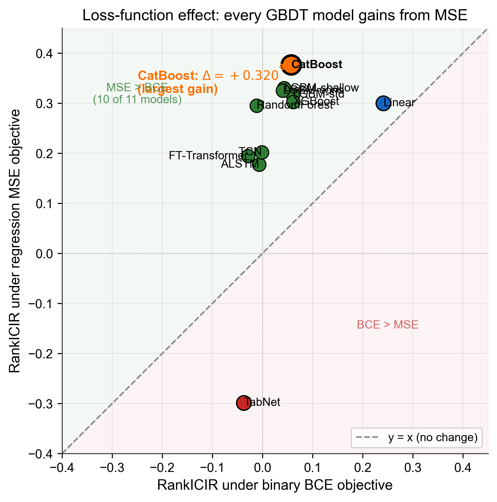

# BBAQ-MAS: Bull-Bear Adversarial Quantitative Multi-Agent System

> Anonymous code release accompanying the paper *Bull–Bear Adversarial Quantitative Multi-Agent System for Cross-Sectional Stock Selection in Chinese A-Share Markets* (under review).
>
> **Universe:** 3,876 A-share stocks · **Test panel:** 733 trading days (2023-01-03 → 2026-01-30)

A four-agent adversarial framework that combines a return-seeking **Alpha Agent**, a one-sided downside **Bear Agent** with error-informed sample weighting, a short-horizon **Reversal Agent**, and a market **Regime Agent** controlling adaptive weights. A separate **Circuit-Breaker (Agent 4)** modulates portfolio exposure in crash and bear regimes. The system targets cross-sectional ranking quality (RankICIR) while preserving Sharpe and drawdown control.

---

## 1. Headline Results

| Configuration | RankICIR | Top-5% Sharpe | Top-5% MaxDD | AnnRet |
|---|---:|---:|---:|---:|
| B0 — Global CatBoost (17 features) | 0.2974 | +0.920 | −42.84% | — |
| Trend single-agent (Alpha only) | 0.5979 | +1.694 | −34.20% | — |
| D1c — Adversarial (regime-aware α) | 0.7438 | +1.829 | −33.28% | — |
| D2c — + Error-Informed Bear (λ=3.0) | 0.7505 | +1.809 | −33.53% | — |
| **D2f** — + Reversal Agent (adaptive γ) | **0.8094** | +1.679 | −33.83% | +23.54% |
| **D2f + Agent 4 (F3-v2 ★)** | **0.8094** | **+1.894** | **−27.27%** | +21.26% |

**Walk-forward 2019–2025:** 7/7 years above Trend baseline. **Bootstrap N=1000:** Δ(D2f − Trend) = +0.201 (95% CI [+0.156, +0.244], p < 0.001).

The four-agent system delivers a **+2,115 bp RankICIR lift over single-agent Trend** with simultaneous Sharpe improvement (+0.20) and MaxDD reduction (+6.93 pp), under realistic 0.30% round-trip transaction cost.

The validation-honest variant (γ_0 = 0.50, δ = 0.05 selected on the 2022 validation set) reaches RankICIR = 0.8011 on the test panel; this 83 bp gap below the canonical configuration is documented in the robustness section as a test-set-optimisation premium.

---

## 2. System Architecture



The conviction score for stock $i$ on trading day $t$ is

```
c(i,t) = s_alpha(i,t)  −  α(t) · s_bear(i,t)  +  γ(t) · s_reversal(i,t)
```

with cross-section z-scored agent outputs and regime-conditioned weights

```
α(t) = 0.50 + 0.15·𝟙[bear] − 0.15·𝟙[bull]    ∈ [0.35, 0.65]
γ(t) = 0.40 + 0.15·𝟙[bull] − 0.15·𝟙[bear]    ∈ [0.25, 0.55]
```

Portfolio: equal-weighted Top-5% by `c(i,t)`, 5-day holding period, 0.30% round-trip cost.

### Four cooperating agents

| Agent | Backbone | Features | Target | Role |
|---|---|---|---|---|
| **Alpha** | CatBoost-regressor | G1–G4 (21d, trend / momentum / vol) | r_future_5d | Symmetric mean-return predictor |
| **Bear (D2, λ=3.0)** | CatBoost-regressor + AdaBoost-style weights | G1+G3 (momentum + strength) | max_drawdown_5d | One-sided downside-tail predictor |
| **Reversal** | CatBoost-regressor | short-term reversal (rev_zscore_1d, rev_mkt_excess_1d, etc.) | r_future_5d | Mean-reversion residual |
| **Regime** | CatBoost-classifier | macro / market features | bear / sideway / bull | Controls α(t), γ(t) |

### Circuit-Breaker (Agent 4 / F3-v2)

A portfolio-level exposure modulator (does not change cross-section ranking):

```
exposure = 0.5 if 1-day market return < −3%        # crash
         = 0.7 if regime = bear                    # bear-defensive
         = 1.0 otherwise
```

Triggers on **262 / 733 (35.7%)** of test days. Sharpe lift +1.679 → +1.894 (+0.215); MaxDD shrinkage −33.83% → −27.27% (+6.56 pp).

---

## 3. The Mechanism — Why Adversarial Subtraction ≠ Linear Ensemble

A controlled experiment using *identical* G1+G3 features but mirrored targets isolates the contribution of loss-asymmetric subtraction:


| α | X = Trend + α·M1 (additive ensemble) | Y = Trend − α·D1 (adversarial) | Δ (bp) |
|---:|---:|---:|---:|
| 0.1 | 0.6068 | 0.6541 | +473 |
| 0.2 | 0.6047 | 0.6918 | +871 |
| 0.3 | 0.5948 | 0.7162 | +1,215 |
| **0.5** | **0.5631** | **0.7408** | **+1,777** |

The additive branch (X) *degrades* monotonically as α grows; the adversarial branch (Y) keeps gaining. With identical features, the only difference is the target function:

- `M1` regresses against `r_future_5` directly (symmetric, mean-seeking).
- `D1` regresses against `max_drawdown_5d` (one-sided, tail-seeking).

The two trained functions are partially anti-correlated (ρ ≈ −0.33) but **not algebraic negations**. The 1,777 bp gap at α=0.5 is the empirical signature of loss-asymmetric target engineering.

---

## 4. Main Ablation Chain


Each configuration adds one architectural feature to the previous row. RankICIR is measured against `r_future_5` on the 733-day test panel.

| Code | Configuration | RankICIR | Sharpe | MaxDD |
|---|---|---:|---:|---:|
| B0 | Global CatBoost (17 features) | 0.2974 | +0.920 | −42.84% |
| M1 | G1+G3 global additive baseline | 0.2560 | +0.746 | −42.24% |
| T | Trend pure (Alpha-only) | 0.5979 | +1.694 | −34.20% |
| BC | `|bias_60|` heuristic Bear, α=0.2 | 0.6325 | +1.750 | −33.33% |
| D1a | D1 adversarial, α=0.2 | 0.6918 | +1.753 | −33.72% |
| D1b | D1 adversarial, α=0.5 | 0.7408 | +1.802 | −33.52% |
| D1c | + adaptive α(t) | 0.7438 | +1.829 | −33.28% |
| D2c | + error-informed Bear (λ=3.0) | 0.7505 | +1.809 | −33.53% |
| D2f | + Reversal + adaptive γ(t) | 0.8094 | +1.679 | −33.83% |
| **D2f + Agent 4** | + F3-v2 circuit breaker ★ | **0.8094** | **+1.894** | **−27.27%** |

---

## 5. Walk-Forward 7-Year Validation (2019–2025)


Out-of-sample retraining for each year. D2f beats Trend in **7 / 7** windows and beats D1c on RankICIR in **7 / 7** windows.

| Year | Trend RIC | D1c RIC | D2c RIC | **D2f RIC** | D2f Sharpe | D1c Sharpe |
|---|---:|---:|---:|---:|---:|---:|
| 2019 | 0.7679 | 0.8061 | 0.7506 | **0.9001** | +2.509 | +2.844 |
| 2020 | 0.2797 | 0.3502 | 0.3538 | **0.4657** | +1.264 | +1.295 |
| 2021 | 0.4929 | 0.5423 | 0.5572 | **0.6520** | +3.365 | +3.624 |
| 2022 | 0.6322 | 0.7855 | 0.7929 | **0.8288** | −0.066 | −0.014 |
| 2023 | 0.7423 | 0.8685 | 0.8477 | **0.9419** | −0.419 | −0.300 |
| 2024 | 0.5600 | 0.7094 | 0.7197 | **0.7305** | +0.997 | +1.044 |
| 2025 | 0.6872 | 0.7570 | 0.7590 | **0.8819** | +5.218 | +5.851 |
| **Mean** | **0.5946** | **0.6884** | **0.6830** | **0.7716** | +1.838 | +2.049 |

D1c achieves slightly higher Sharpe on average; D2f achieves higher RankICIR. The paper presents both as the **BBAQ-MAS-SR** (Sharpe-optimised) and **BBAQ-MAS-IC** (IC-optimised) variants — a verified IC-vs-Sharpe trade-off (bootstrap p < 0.001 in both directions).

---

## 6. Bear Agent Independence — Quintile Diagnostic


Sorting stocks by Bear score and partitioning into five buckets:

| Quintile | n | Mean Bear score | MaxDD_5d (%) | r_future_5 (%) | MaxDD rank | Return rank |
|---|---:|---:|---:|---:|---:|---:|
| Q1 (safest) | 563,172 | −0.235 | 2.24 | +0.475 | 1 | 4 |
| Q2 | 563,445 | −0.149 | 2.61 | +0.544 | 2 | 1 |
| Q3 | 563,444 | −0.072 | 2.91 | +0.540 | 3 | 2 |
| Q4 | 563,445 | +0.046 | 3.27 | +0.475 | 4 | 3 |
| Q5 (riskiest) | 563,724 | +0.421 | 4.61 | +0.021 | 5 | 5 |
| **Q5 − Q1 gap** | — | +0.656 | **+2.37 pp** | −0.454 pp | — | — |

**MaxDD ranking is perfectly monotone** (Q1→Q5 = 1→5), but **return ranking is non-monotone** (4-1-2-3-5). The Bear Agent is a *drawdown predictor*, not a sign-flipped Alpha — verifying the independence axis required for the adversarial subtraction to add information.

---

## 7. Why CatBoost — Model Selection (14 candidates)


Eleven supervised models + three momentum-factor baselines, evaluated under both BCE (binary) and MSE (regression) tracks:



**Findings:**
- **Regression beats binary for 10 / 11 models** — MSE on `r_future_5` retains more ordinal information than BCE on the thresholded label.
- **CatBoost-reg wins on RankICIR** (0.3763) and is adopted as the canonical agent backbone.
- Sequence models (TCN, ALSTM) and tabular DL (TabNet, FT-Transformer) underperform GBDT despite 10–100× more training time.

## 8. Feature-Group Ablation


| Feature set | # | RankICIR |
|---|---:|---:|
| G1 (price/return) | 5 | 0.0098 |
| G1+G2 (+volume/turnover) | 8 | 0.0177 |
| G1+G2+G3 (+technical) | 19 | 0.3006 |
| **G1+G2+G3+G4 ★** (+volatility) | 21 | **0.3707** |
| G1+G2+G3+G4+G5 (+market beta) | 24 | 0.2534 |
| Full G1–G6 (+sentiment) | 28 | 0.3296 |

**G4 (volatility) is the largest single contributor.** G5 hurts (sentiment proxies introduce noise on this dataset). Canonical Alpha features: **G1–G4 (21d)**.

---

## 9. SHAP Regime Divergence — Empirical Motivation for Adversarial Bear


SHAP Regime Divergence (Jaccard distance between top-10 SHAP feature sets across bear / sideway / bull regimes):

| Configuration | SRD(bear, bull) | SRD(bear, side) | SRD(bull, side) |
|---|---:|---:|---:|
| LightGBM-shallow, G1–G4 | 0.291 | 0.308 | 0.575 |
| **CatBoost-reg, G1–G4** | **0.694** | **0.488** | 0.543 |

CatBoost-reg drives the bear/bull SHAP feature divergence to **0.694** (vs LightGBM's 0.291), revealing that the model has learned dramatically different feature attribution under different regimes. This is the empirical justification for cloning the Alpha Agent into a dedicated **Bear Agent with regime-specific targeting**, rather than relying on a single multi-regime model.

---

## 10. Experimental Pipeline (20 Steps)

The system was developed and validated through 20 sequential experiments under `bull_bear/experiments/`:

| # | Script | Purpose |
|---|---|---|
| 1–2 | `step1_train_bear.py`, `step2_bear_v2.py` | Train Bear V1 / V2 (baseline + abs/sq features) |
| 3 | `step3_parallel.py` | D1 / D2 / D3 three-direction comparison; D1 selected |
| 4 | `step4_mechanism.py` | X (additive) vs Y (adversarial) mechanism proof |
| 5–6 | `step5_final_ablation.py`, `step6_final_validation.py` | Main ablation + reviewer-grade validation |
| 7 | `step7_agent_interactions.py` | Bear sample weighting introduced |
| 8 | `step8_d2_peak_search.py` | λ peak search → λ = 3.0 confirmed |
| 9 | `step9_d2c_anomaly_position.py` | Anomaly-day position scaling diagnostic |
| 11–12 | `step11_agent4_redesign.py`, `step12_d2f_final.py` | Reversal Agent design + D2f finalization |
| 13 | `step13_gamma_adaptive.py` | Regime-conditioned γ(t) |
| 14 | `step14_bear_attribution_and_risk_manager.py` | Bear attribution analysis |
| 15 | `step15_d1c_vs_d2f.py` | SR-vs-IC trade-off (BBAQ-MAS-SR / BBAQ-MAS-IC) |
| 16 | `step16_agent4_practical.py` | Agent 4 / F1 / F2 / F3-v2 circuit breaker |
| 17 | `step17_leakage_robustness.py` | Validation-vs-test selection gap + parameter sensitivity |
| 18 | `step18_elliott_wave.py` | Elliott Wave integration test (negative result) |
| 19 | `step19_wave_deviation_02.py` | Wave deviation sensitivity |
| 20 | `step20_holding_period.py` | Holding-period sweep (2 / 3 / 5 d) + Alpha in-sample/OOF diagnostic |

---

## 11. Repository Structure

```
.
├── README.md                        ← this file
├── requirements.txt
├── config.py                        ← global paths, column names, hyper-params
├── waves_agent.py                   ← Elliott Wave module (step 18–19)
│
├── bull_bear/                       ← MAIN PROJECT
│   ├── config_bb.py                 ← Bull-Bear specific config
│   ├── src/                         ← Bear Agent + targets + feature engineering + metrics_utils
│   ├── experiments/                 ← step1 – step20 (the 20-step pipeline)
│   ├── results/                     ← CSV outputs of every step + trained .cbm models
│   └── delivery/                    ← curated reproduction package
│       ├── README.md
│       ├── paper/                   ← final PDF + per-section data bundle
│       ├── models/                  ← trained .cbm binaries
│       ├── results/                 ← organised by experiment role
│       │   ├── ablation/
│       │   ├── validation/
│       │   ├── robustness/
│       │   └── model_selection/
│       └── src/                     ← reproduction code (features + agents + backtest)
│
├── figure/                          ← all paper figures (17 PNGs, 300 dpi)
│
├── results/                         ← model-selection canonical CSVs (§5.2–§5.4)
│   ├── main_compare_*/              ← 14-model comparison (BCE + MSE)
│   ├── feature_ablation_*/          ← G1–G6 feature ablation
│   ├── regime_*/                    ← SHAP regime divergence (LGB + CatBoost)
│   └── shap_*_reg/                  ← regression-track SHAP outputs
│
├── src/                             ← shared utilities (parent project)
│   ├── data.py, features.py, backtest.py, metrics.py
│   ├── regime_ensemble.py
│   └── models/                      ← 14-model zoo (gbdt, linear, sequence, tabular_dl, factor)
│
├── experiments/                     ← model-selection driver scripts
│   ├── run_main_compare.py          ← reproduce 14-model comparison
│   ├── run_feature_ablation.py
│   ├── run_regime_analysis.py
│   ├── run_regression_loss.py
│   └── run_shap.py
│
└── scripts/                         ← figure / bundle / delivery generators
    ├── build_delivery.py            ← (re)assemble bull_bear/delivery/
    ├── make_paper_figures.py        ← framework + Y-vs-X
    ├── make_paper_figures_v2.py     ← 8 paper figures (academic style)
    └── make_experiments_figures.py  ← supplementary figures
```

---

## 12. Reproduction

### Quickstart — read-only review

The compiled paper and all numerical artifacts are pre-built in `bull_bear/delivery/`:

```
bull_bear/delivery/paper/bull_bear_paper.pdf       ← final manuscript
bull_bear/delivery/paper/data_bundle.md            ← per-section data appendix (§5.1 – §5.14)
bull_bear/delivery/README.md                       ← system overview + reproduction hints
bull_bear/delivery/results/                        ← all canonical CSVs
bull_bear/delivery/models/                         ← all trained .cbm binaries
```

No environment setup is required to read these.

### Full reproduction — retrain from scratch

```bash
# Python 3.10+, single CPU is fine (each agent trains in ~3.5 min)
pip install -r requirements.txt

# Place your dataset parquet at the path defined in config.py
# (required columns: G1–G7 features, ret_1d, r_future_5, macro_regime_3)

# 1. Train the four agents (uses canonical λ=3.0, γ_adaptive)
python -m bull_bear.experiments.step12_d2f_final     # D2f + walk-forward + bootstrap

# 2. Run the full validation / robustness suite
python -m bull_bear.experiments.step15_d1c_vs_d2f    # 7-year IC vs SR trade-off
python -m bull_bear.experiments.step16_agent4_practical  # F3-v2 circuit breaker
python -m bull_bear.experiments.step17_leakage_robustness  # parameter sensitivity
python -m bull_bear.experiments.step20_holding_period      # holding-period sweep + in-sample/OOF
```

Each script is self-contained: loads the dataset, trains the relevant models (or reuses cached ones from previous steps), runs evaluation, writes results to `bull_bear/results/`.

### Regenerate paper figures

```bash
python scripts/make_paper_figures_v2.py     # 8 main paper figures
python scripts/make_experiments_figures.py  # supplementary figures
python scripts/make_paper_figures.py        # framework + Y-vs-X
# Outputs land in figure/
```

### Rebuild the delivery package

```bash
python scripts/build_delivery.py
# Re-assembles bull_bear/delivery/ from current results, models, figures, code
```

---

## 13. Data

| Item | Value |
|---|---|
| Universe | 3,876 A-share stocks (SH + SZ + ChiNext + STAR) |
| Date range | 2016-10-17 → 2026-01-19 |
| Total panel rows | 7.17 million |
| Forward return target | `r_future_5 = close[t+5] / close[t] − 1` |
| Train split | 2016-01-01 → 2021-12-31 |
| Validation split | 2022-01-01 → 2022-12-31 (hyperparameter selection only) |
| Test split | 2023-01-03 → 2026-01-30 (733 days, never seen during training or tuning) |
| Walk-forward | 7 expanding windows (W1: train 2016-2018 → test 2019, ..., W7: train 2016-2024 → test 2025) |

**Note:** The underlying dataset parquet is not included in the repository for licensing reasons. The required schema is documented in `src/features.py`. To reproduce, place a compatible parquet at the path defined in `config.py`.

---

## 14. Key Output Files (for Reviewers)

| File | Paper section |
|---|---|
| `bull_bear/delivery/paper/data_bundle.md` | All sections — per-section data appendix |
| `bull_bear/delivery/results/ablation/final_ablation.csv` | §5.5 — main ablation chain |
| `bull_bear/delivery/results/ablation/mechanism_validation.csv` | §5.6 — Y vs X mechanism proof |
| `bull_bear/delivery/results/ablation/step8_d2_peak.csv` | §5.7 — λ peak search |
| `bull_bear/delivery/results/ablation/step12_gamma_peak.csv` | §5.8 — γ peak search |
| `bull_bear/delivery/results/validation/step15_walkforward_d1c_vs_d2f.csv` | §5.9 — 7-year walk-forward |
| `bull_bear/delivery/results/validation/bootstrap_test.csv` | §5.10 — statistical significance |
| `bull_bear/delivery/results/validation/bear_quintile_analysis.csv` | §5.11 — Bear independence |
| `bull_bear/delivery/results/ablation/step16_agent4_practical.csv` | §5.12 — Agent 4 circuit breaker |
| `bull_bear/delivery/results/robustness/step17_*.csv` | §5.13 — parameter sensitivity |
| `bull_bear/delivery/results/robustness/step20_*.csv` | §6.4 — holding-period sweep + in-sample diagnostic |

---

## 15. License

The code in this repository is released under the **MIT License**.

The underlying A-share market data is not redistributed here due to commercial licensing restrictions. The data schema is documented in `src/features.py` so that compatible datasets can be substituted.
