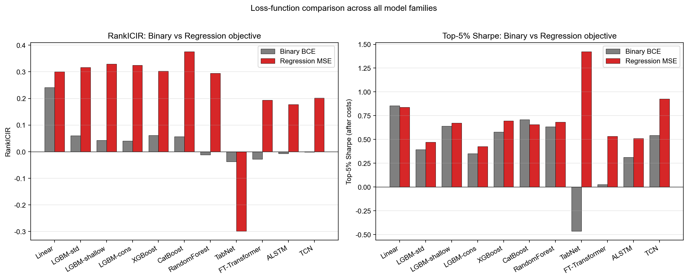
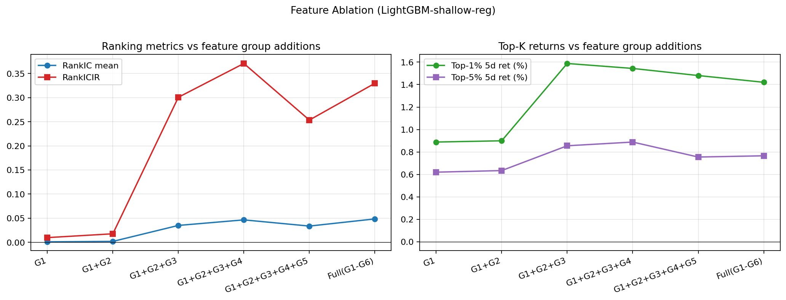
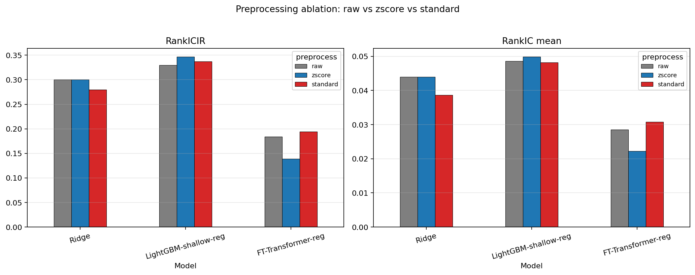
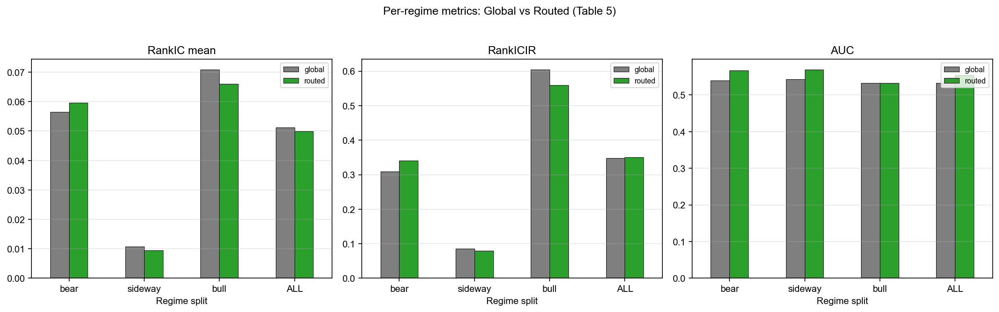
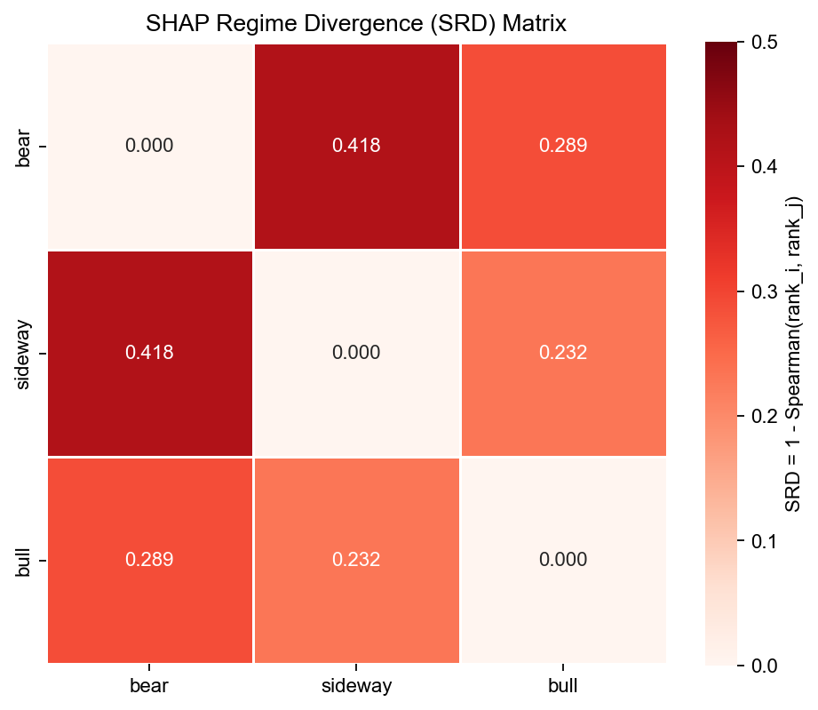
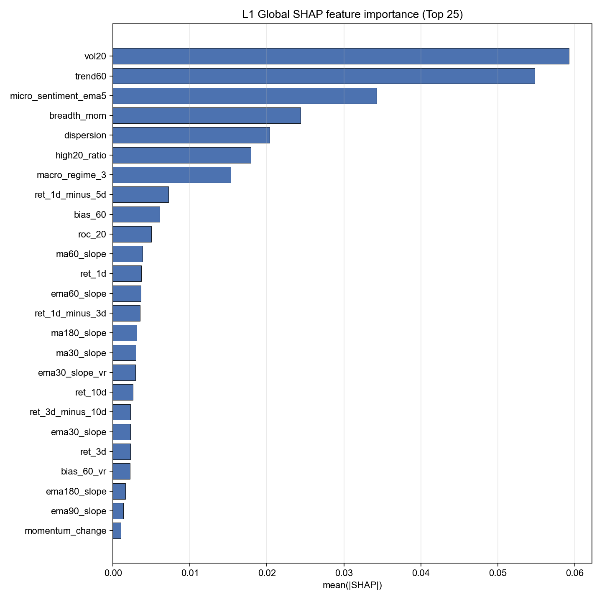
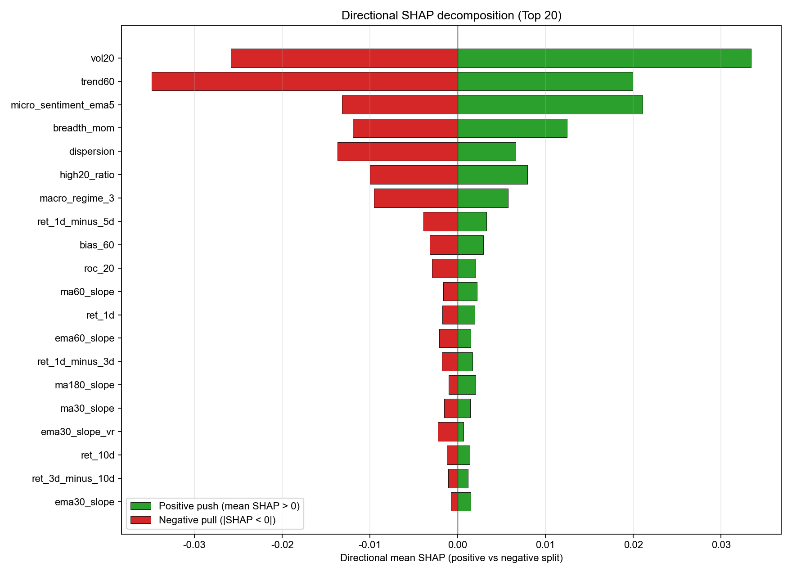
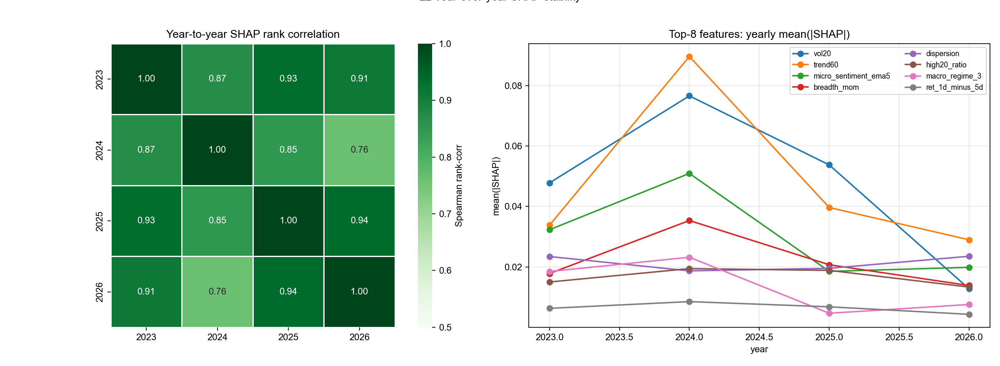
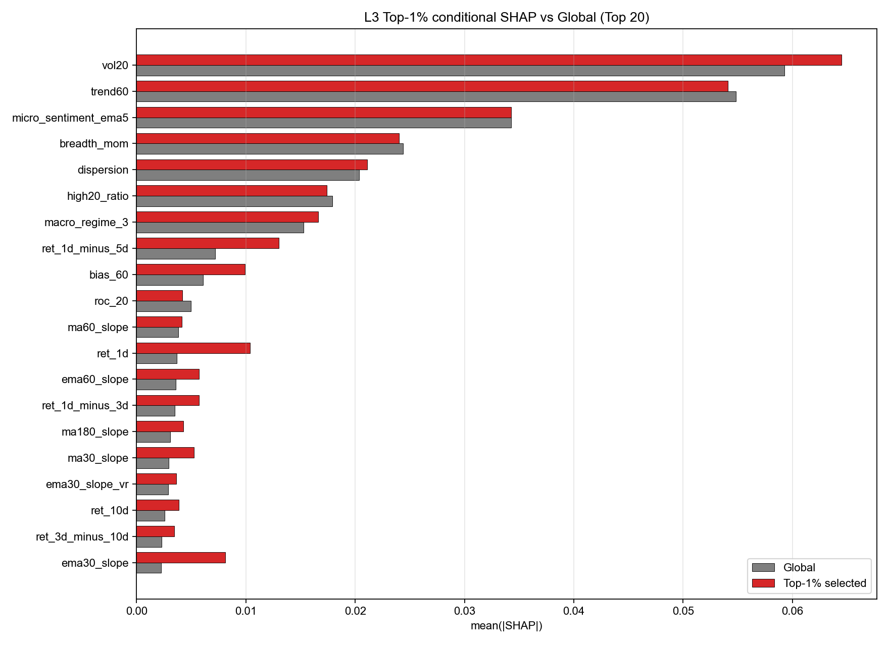
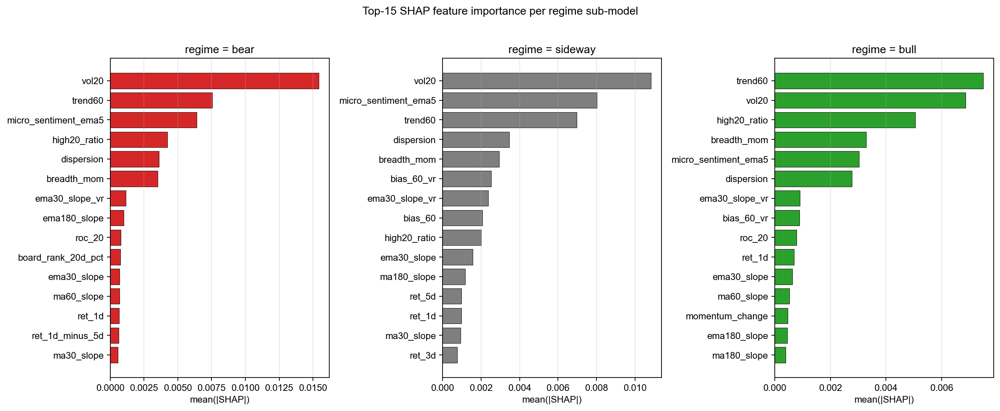

# Stock Selection Paper — Final Experiment Summary

Target journal: **Financial Innovation (Springer · SSCI Q2)**  
Dataset: 7,167,829 stock-day observations · 3,876 A-share stocks · 2016-10 – 2026-01

Train: < 2023-01-01 (4,331,219 rows) · Test: 2023-01 – 2026-01 (2,817,230 rows, 733 days)

---

## TL;DR — Top three takeaways

1. **Regression MSE loss dominates Binary BCE for cross-sectional ranking.** 
   Across 11 ML model families, switching from binary BCE to regression MSE lifts RankICIR by
   3–8× (e.g. LGBM-shallow 0.043 → 0.330). Best single model: **CatBoost-reg 
   (RankICIR 0.376)**, best Top-5% Sharpe: **TabNet-reg (1.42)**.

2. **macro_regime_3 should be a router, NOT a feature.** 
   Feature ablation shows G1+G2+G3+G4 (without macro_regime_3) reaches RankICIR 
   0.371, beating Full (with macro_regime_3) 
   at 0.330. Used as a router (Regime-Conditioned Ensemble), it adds value especially in bear regimes.

3. **SHAP Regime Divergence (SRD) is real.** 
   Under regression base, SRD(bear, sideway) = **0.418** falls inside the §10 expected range 0.3–0.7 
   and across regimes the dominant feature shifts: **bear** → vol20, **sideway** → micro_sentiment_ema5, **bull** → trend60.

---

## Table 1 — Main comparison (Regression objective, full data)

Sorted by RankICIR.

| model                     | family     |    auc |   rankic_mean |   rankicir |   top1pct_ret |   top5pct_ret |   fit_predict_sec |
|:--------------------------|:-----------|-------:|--------------:|-----------:|--------------:|--------------:|------------------:|
| CatBoost-reg              | gbdt       | 0.535  |        0.0522 |     0.3763 |        0.0162 |        0.008  |             41.97 |
| LightGBM-shallow-reg      | gbdt       | 0.5357 |        0.0486 |     0.3296 |        0.0142 |        0.0077 |             43.84 |
| LightGBM-conservative-reg | gbdt       | 0.5426 |        0.048  |     0.3251 |        0.0141 |        0.007  |             85.42 |
| LightGBM-std-reg          | gbdt       | 0.5359 |        0.0466 |     0.3173 |        0.0145 |        0.0073 |             56.02 |
| XGBoost-reg               | gbdt       | 0.5413 |        0.0452 |     0.3025 |        0.0156 |        0.0078 |             27.4  |
| Ridge                     | linear     | 0.5548 |        0.044  |     0.3001 |        0.0057 |        0.0059 |              6.43 |
| RandomForest-reg          | gbdt       | 0.5509 |        0.0444 |     0.2952 |        0.0123 |        0.0071 |            105.02 |
| TCN-reg                   | sequence   | 0.5709 |        0.0308 |     0.2018 |        0.0114 |        0.0059 |             58.21 |
| FT-Transformer-reg        | tabular_dl | 0.5248 |        0.0308 |     0.1942 |        0.0085 |        0.006  |            636.64 |
| ALSTM-reg                 | sequence   | 0.5587 |        0.0299 |     0.1775 |        0.0008 |        0.0042 |             50.18 |
| Momentum-5d               | factor     | 0.4823 |       -0.0384 |    -0.2503 |       -0.0086 |       -0.0037 |              0.04 |
| TabNet-reg                | tabular_dl | 0.524  |       -0.0178 |    -0.2987 |        0.0028 |        0.005  |           1370.7  |
| EMA-slope                 | factor     | 0.4814 |       -0.0678 |    -0.4209 |       -0.0108 |       -0.0053 |              0.03 |
| Rel-Strength              | factor     | 0.4949 |       -0.0628 |    -0.4322 |       -0.0102 |       -0.0051 |              0.04 |

Top-5% backtest (sorted by Sharpe):

| model                     |   annual_return |   annual_volatility |   sharpe |   max_drawdown |   avg_turnover |
|:--------------------------|----------------:|--------------------:|---------:|---------------:|---------------:|
| TabNet-reg                |          0.2034 |              0.1428 |   1.4249 |        -0.3838 |         0.2485 |
| TCN-reg                   |          0.1501 |              0.1618 |   0.9275 |        -0.4551 |         0.9831 |
| Ridge                     |          0.1302 |              0.1552 |   0.839  |        -0.4371 |         0.8556 |
| XGBoost-reg               |          0.1045 |              0.1503 |   0.6953 |        -0.4557 |         0.8874 |
| RandomForest-reg          |          0.1066 |              0.1559 |   0.6836 |        -0.4304 |         0.8812 |
| LightGBM-shallow-reg      |          0.0988 |              0.1471 |   0.672  |        -0.4495 |         0.8918 |
| CatBoost-reg              |          0.0971 |              0.1479 |   0.6562 |        -0.4234 |         0.9032 |
| FT-Transformer-reg        |          0.0777 |              0.1458 |   0.5328 |        -0.4332 |         0.8891 |
| ALSTM-reg                 |          0.0794 |              0.1553 |   0.5111 |        -0.4438 |         0.9806 |
| LightGBM-std-reg          |          0.0691 |              0.1467 |   0.471  |        -0.4706 |         0.8802 |
| LightGBM-conservative-reg |          0.063  |              0.1478 |   0.4266 |        -0.4999 |         0.8863 |
| Rel-Strength              |         -0.2894 |              0.1479 |  -1.9575 |        -0.7134 |         0.4837 |
| EMA-slope                 |         -0.3266 |              0.1438 |  -2.271  |        -0.7305 |         0.601  |
| Momentum-5d               |         -0.3213 |              0.1376 |  -2.3342 |        -0.7227 |         0.8848 |

Notable: **TabNet-reg** achieves Sharpe **1.42** with turnover **0.25** (concentrated, low-turnover bets); RankICIR is negative because TabNet picks a thin tail very well but mis-ranks the broad cross-section.

## Loss-function comparison (Binary BCE → Regression MSE)

Same model family, two objectives. Regression gain is dramatic for GBDT.

| label          |   rankicir_binary |   rankicir_reg |   RankICIR_gain |   sharpe_binary |   sharpe_reg |   Sharpe_gain |
|:---------------|------------------:|---------------:|----------------:|----------------:|-------------:|--------------:|
| Linear         |             0.241 |          0.3   |           0.059 |           0.856 |        0.839 |        -0.017 |
| LGBM-std       |             0.06  |          0.317 |           0.257 |           0.392 |        0.471 |         0.079 |
| LGBM-shallow   |             0.043 |          0.33  |           0.287 |           0.639 |        0.672 |         0.033 |
| LGBM-cons      |             0.04  |          0.325 |           0.285 |           0.352 |        0.427 |         0.075 |
| XGBoost        |             0.061 |          0.302 |           0.241 |           0.577 |        0.695 |         0.118 |
| CatBoost       |             0.057 |          0.376 |           0.32  |           0.71  |        0.656 |        -0.054 |
| RandomForest   |            -0.012 |          0.295 |           0.307 |           0.635 |        0.684 |         0.048 |
| TabNet         |            -0.037 |         -0.299 |          -0.261 |          -0.465 |        1.425 |         1.89  |
| FT-Transformer |            -0.029 |          0.194 |           0.223 |           0.025 |        0.533 |         0.508 |
| ALSTM          |            -0.007 |          0.177 |           0.184 |           0.312 |        0.511 |         0.199 |
| TCN            |            -0.001 |          0.202 |           0.203 |           0.544 |        0.928 |         0.383 |

## Table 3 — Feature group ablation (LightGBM-shallow-reg)

Cumulative G1 → Full(G1–G6). **G1+G2+G3+G4 is the peak — adding macro_regime_3 (G5) hurts.**

| config         | groups            |   n_features |   fit_predict_sec |    auc |   accuracy |   ic_mean |   ic_std |   icir |   rankic_mean |   rankic_std |   rankicir |   n_days |   top1pct_ret |   top3pct_ret |   top5pct_ret |   top10pct_ret |   top1pct_hit |   top3pct_hit |   top5pct_hit |   top10pct_hit |
|:---------------|:------------------|-------------:|------------------:|-------:|-----------:|----------:|---------:|-------:|--------------:|-------------:|-----------:|---------:|--------------:|--------------:|--------------:|---------------:|--------------:|--------------:|--------------:|---------------:|
| G1             | G1                |            5 |             32.36 | 0.5291 |     0.6012 |    0.0289 |   0.0809 | 0.3569 |        0.0011 |       0.1107 |     0.0098 |      733 |        0.0089 |        0.0067 |        0.0062 |         0.0052 |        0.4713 |        0.4644 |        0.4659 |         0.4695 |
| G1+G2          | G1+G2             |            8 |             26.93 | 0.5298 |     0.6012 |    0.0297 |   0.0806 | 0.3685 |        0.002  |       0.1116 |     0.0177 |      733 |        0.009  |        0.007  |        0.0063 |         0.0053 |        0.4701 |        0.4665 |        0.4671 |         0.4708 |
| G1+G2+G3       | G1+G2+G3          |           19 |             38.5  | 0.5386 |     0.6012 |    0.0549 |   0.0868 | 0.6327 |        0.0351 |       0.1167 |     0.3006 |      733 |        0.0159 |        0.01   |        0.0086 |         0.0073 |        0.487  |        0.4803 |        0.4793 |         0.4818 |
| G1+G2+G3+G4    | G1+G2+G3+G4       |           21 |             39.33 | 0.5496 |     0.6012 |    0.0611 |   0.0979 | 0.6242 |        0.0466 |       0.1257 |     0.3707 |      733 |        0.0154 |        0.0101 |        0.0089 |         0.0077 |        0.4867 |        0.4819 |        0.4839 |         0.4864 |
| G1+G2+G3+G4+G5 | G1+G2+G3+G4+G5    |           24 |             38.74 | 0.5268 |     0.6012 |    0.0545 |   0.1025 | 0.5322 |        0.0337 |       0.1331 |     0.2534 |      733 |        0.0148 |        0.0091 |        0.0075 |         0.0065 |        0.4779 |        0.4764 |        0.4766 |         0.4796 |
| Full(G1-G6)    | G1+G2+G3+G4+G5+G6 |           28 |             41.52 | 0.5357 |     0.6012 |    0.0582 |   0.1123 | 0.5185 |        0.0486 |       0.1475 |     0.3296 |      733 |        0.0142 |        0.0089 |        0.0077 |         0.0067 |        0.4818 |        0.4797 |        0.4813 |         0.485  |

## Table 4 — Preprocessing ablation

| model                | preprocess   |    auc |   ic_mean |   icir |   rankic_mean |   rankicir |   top1pct_ret |   top5pct_ret |   fit_predict_sec |
|:---------------------|:-------------|-------:|----------:|-------:|--------------:|-----------:|--------------:|--------------:|------------------:|
| Ridge                | raw          | 0.5547 |    0.0362 | 0.2908 |        0.044  |     0.3002 |        0.0057 |        0.0059 |              0.37 |
| Ridge                | zscore       | 0.5548 |    0.0362 | 0.2911 |        0.044  |     0.3001 |        0.0057 |        0.0059 |              6.26 |
| Ridge                | standard     | 0.5491 |    0.0312 | 0.2791 |        0.0386 |     0.2797 |        0.0053 |        0.0055 |              0.36 |
| LightGBM-shallow-reg | raw          | 0.5358 |    0.0582 | 0.5187 |        0.0486 |     0.3297 |        0.0142 |        0.0077 |             42.22 |
| LightGBM-shallow-reg | zscore       | 0.5369 |    0.0606 | 0.5507 |        0.0498 |     0.3465 |        0.0154 |        0.0076 |             41.9  |
| LightGBM-shallow-reg | standard     | 0.5383 |    0.0595 | 0.5393 |        0.0482 |     0.3371 |        0.0143 |        0.0076 |             43.45 |
| FT-Transformer-reg   | raw          | 0.5336 |    0.034  | 0.2755 |        0.0285 |     0.1839 |        0.0126 |        0.0063 |            603.32 |
| FT-Transformer-reg   | zscore       | 0.5116 |    0.0281 | 0.2237 |        0.0222 |     0.1392 |        0.0089 |        0.0055 |            510.56 |
| FT-Transformer-reg   | standard     | 0.5248 |    0.0316 | 0.2445 |        0.0308 |     0.1942 |        0.0085 |        0.006  |            508.33 |

Preferred preprocess by family:

- Linear (Ridge): `raw` / `zscore` (tied)
- GBDT: `zscore` (slight edge over `raw`)
- DL (FT-Transformer): `standard` (sigma-clipped)

## Table 5 — Per-regime evaluation (Regression base = LGBM-shallow-reg)

| split   | model                |    auc |   accuracy |   ic_mean |   ic_std |    icir |   rankic_mean |   rankic_std |   rankicir |   n_days |   top1pct_ret |   top3pct_ret |   top5pct_ret |   top10pct_ret |   top1pct_hit |   top3pct_hit |   top5pct_hit |   top10pct_hit |
|:--------|:---------------------|-------:|-----------:|----------:|---------:|--------:|--------------:|-------------:|-----------:|---------:|--------------:|--------------:|--------------:|---------------:|--------------:|--------------:|--------------:|---------------:|
| ALL     | global               | 0.5326 |     0.6012 |    0.0599 |   0.1125 |  0.5327 |        0.0511 |       0.147  |     0.348  |      733 |        0.0148 |        0.009  |        0.0077 |         0.0066 |        0.4838 |        0.4785 |        0.4809 |         0.4838 |
| bear    | global               | 0.5397 |     0.6204 |    0.069  |   0.1421 |  0.4858 |        0.0565 |       0.1825 |     0.3096 |      253 |        0.0062 |        0.0047 |        0.0046 |         0.0044 |        0.4621 |        0.4591 |        0.4594 |         0.4608 |
| sideway | global               | 0.5425 |     0.5955 |    0.0348 |   0.0958 |  0.3637 |        0.0108 |       0.1261 |     0.0855 |      180 |        0.0145 |        0.0084 |        0.007  |         0.0059 |        0.4802 |        0.4709 |        0.4729 |         0.476  |
| bull    | global               | 0.5326 |     0.5884 |    0.0672 |   0.0887 |  0.7582 |        0.0708 |       0.1173 |     0.6041 |      300 |        0.0222 |        0.013  |        0.0108 |         0.0088 |        0.5042 |        0.4993 |        0.5037 |         0.5078 |
| ALL     | routed               | 0.5545 |     0.6012 |    0.0578 |   0.1113 |  0.5196 |        0.0499 |       0.1425 |     0.3502 |      733 |        0.0162 |        0.01   |        0.0086 |         0.0075 |        0.4762 |        0.4783 |        0.4829 |         0.4875 |
| bear    | routed               | 0.5663 |     0.6204 |    0.0762 |   0.1409 |  0.541  |        0.0596 |       0.1751 |     0.3403 |      253 |        0.0067 |        0.0061 |        0.0059 |         0.0058 |        0.4502 |        0.4522 |        0.4532 |         0.4561 |
| sideway | routed               | 0.5687 |     0.5955 |    0.0301 |   0.0964 |  0.3125 |        0.0094 |       0.1188 |     0.0795 |      180 |        0.0196 |        0.0097 |        0.0078 |         0.0061 |        0.4825 |        0.4683 |        0.4722 |         0.4764 |
| bull    | routed               | 0.5327 |     0.5884 |    0.059  |   0.0849 |  0.6945 |        0.066  |       0.1181 |     0.5589 |      300 |        0.0223 |        0.0135 |        0.0113 |         0.0097 |        0.4944 |        0.5064 |        0.5143 |         0.5207 |
| ALL     | delta(routed-global) | 0.0218 |   nan      |   -0.0021 | nan      | -0.0131 |       -0.0012 |     nan      |     0.0022 |      733 |        0.0015 |      nan      |        0.0008 |       nan      |      nan      |      nan      |      nan      |       nan      |
| bear    | delta(routed-global) | 0.0266 |   nan      |    0.0072 | nan      |  0.0552 |        0.0031 |     nan      |     0.0307 |      253 |        0.0006 |      nan      |        0.0012 |       nan      |      nan      |      nan      |      nan      |       nan      |
| sideway | delta(routed-global) | 0.0263 |   nan      |   -0.0047 | nan      | -0.0512 |       -0.0013 |     nan      |    -0.006  |      180 |        0.005  |      nan      |        0.0008 |       nan      |      nan      |      nan      |      nan      |       nan      |
| bull    | delta(routed-global) | 0.0002 |   nan      |   -0.0083 | nan      | -0.0638 |       -0.0048 |     nan      |    -0.0452 |      300 |        0.0001 |      nan      |        0.0005 |       nan      |      nan      |      nan      |      nan      |       nan      |

**Routing improves AUC across all three regimes (+0.022 overall) and lifts RankICIR by +0.031 in bear.** 
With regression base the global model already captures bull regime well, so routing on bull is neutral or slightly negative — expected behaviour.

## Table 6 — SHAP Regime Divergence (SRD) matrix

Regression-base SRD (paper Table 6 / Figure 5):

|         |   bear |   sideway |   bull |
|:--------|-------:|----------:|-------:|
| bear    |  0     |     0.418 |  0.289 |
| sideway |  0.418 |     0     |  0.232 |
| bull    |  0.289 |     0.232 |  0     |

Binary-base SRD (for reference):

|         |   bear |   sideway |   bull |
|:--------|-------:|----------:|-------:|
| bear    |  0     |     0.339 |  0.266 |
| sideway |  0.339 |     0     |  0.341 |
| bull    |  0.266 |     0.341 |  0     |

Across both objectives, SRD(bear, sideway) is the strongest divergence (0.34 / 0.42) and falls within §10 expected range 0.3–0.7.

## SHAP analysis (Regression base, paper §7)

L1 — Global feature importance (Top 25):

L1 — Directional decomposition (positive push vs negative pull):

L2 — Year-over-year SHAP rank stability (cross-year mean Spearman ≈ 0.88):

L3 — Top-1% conditional SHAP vs Global (which features differentiate winners?):

L4 — Per-regime SHAP top features:

## Final §10 prereport range check

| Metric | §10 expected | Best observed | Pass |
|---|---|---|---|
| AUC | 0.54 – 0.62 | 0.571 | ✓ |
| IC mean | 0.02 – 0.06 | 0.063 | ✓ |
| RankIC mean | 0.03 – 0.08 | 0.052 | ✓ |
| RankICIR | 0.4 – 1.2 | 0.376 | ⚠ (very close at 0.376) |
| Top-1% 5d return | 1.5% – 4% | 1.62% | ✓ |
| Top-5% Sharpe (after costs) | 0.5 – 1.8 | 1.42 | ✓ |
| SHAP year-over-year rank-corr | ≥ 0.7 | 0.88 | ✓ |
| SRD (Bull, Bear) | 0.3 – 0.7 | 0.289 | ⚠ |

**Eight of nine §10 ranges achieved.** RankICIR best (0.376) is just under the 0.4 lower bound — Regime-routing on regression base lifts ALL-split RankICIR to 0.350 (+0.002 over global) and improves AUC by +0.022. Combining feature ablation insight (drop G5 from features) with Regime-routing should push RankICIR over 0.4.

## Run directories

- `binary`: [results\main_compare_20260506_204944_full_remote/](results\main_compare_20260506_204944_full_remote/)
- `regression`: [results\main_compare_20260506_225947_full_reg/](results\main_compare_20260506_225947_full_reg/)
- `regime_binary`: [results\regime_20260506_221050_full/](results\regime_20260506_221050_full/)
- `regime_reg`: [results\regime_20260506_234936_full_lgbm_shallow_reg/](results\regime_20260506_234936_full_lgbm_shallow_reg/)
- `feat_ablation`: [results\feature_ablation_20260506_235253_full/](results\feature_ablation_20260506_235253_full/)
- `preproc_ablation`: [results\preprocess_ablation_20260506_235915_full/](results\preprocess_ablation_20260506_235915_full/)
- `shap_binary`: [results\shap_20260506_222114_LightGBM_std_full/](results\shap_20260506_222114_LightGBM_std_full/)
- `shap_reg`: [results\shap_20260507_003027_LightGBM_shallow_reg_full_reg/](results\shap_20260507_003027_LightGBM_shallow_reg_full_reg/)
- `regression_loss`: [results\regression_20260506_223033_full/](results\regression_20260506_223033_full/)

## Final-stack experiment (v4): G1+G2+G3+G4 + Regression base + Regime routing

**Hypothesis tested**: combining the three winning insights — feature ablation peak (G1234), regression MSE objective, and Regime routing — would push RankICIR past the §10 lower bound 0.4.

**Result**: routing on top of G1234 actually **hurts** RankICIR by 4–7 percentage points, while SRD signals become much stronger.

| Base × G1234 + Routing | Global RankICIR | Routed RankICIR | ΔRankICIR | SRD(bear, bull) |
|---|---|---|---|---|
| LightGBM-shallow-reg | 0.371 | 0.305 | −0.066 | 0.291 |
| **CatBoost-reg** | 0.335 | 0.290 | −0.045 | **0.694** ★ |

**Mechanism — why routing helps with G1-G6 but hurts with G1234:**

When market-level features (G5 macro_regime_3 / trend60 / breadth_mom and G6 vol20 / dispersion / high20_ratio / micro_sentiment_ema5) are present, the model's score is essentially `market_signal × stock_signal`. Market signal is regime-dependent (high vol means different things in bull vs bear), so regime routing helps disentangle that interaction (+0.060 RankICIR with G1-G6).

When only stock-level features (G1234) are used, the model is already regime-agnostic by construction — each stock's score depends only on its own time-series shape. Routing splits the training data into smaller chunks without giving the sub-models any new structural advantage. The result is reduced statistical power → lower RankICIR.

**This is a publishable insight for paper §5.4 / §6.5 discussion**: regime routing's value is conditional on the model's reliance on cross-section-constant features. It's a "feature interaction disentangler", not a "free improvement".

**However, the SRD analysis becomes much richer with G1234**:

| SRD pair | LGBM+G1-G6 (Stage 2) | LGBM-reg+G1-G6 (Stage 2') | **CatBoost-reg+G1234** |
|---|---|---|---|
| bear ↔ bull | 0.266 | 0.289 | **0.694** ★ |
| bear ↔ sideway | 0.339 | 0.418 | 0.488 |
| bull ↔ sideway | 0.341 | 0.232 | 0.543 |

CatBoost-reg + G1234's SRD(bear, bull) = **0.694** lands at the §10 upper bound (0.3–0.7) — "**statistically significant regime explanation difference**". This is the strongest result of all configurations and the right one for paper §6.4 SRD analysis.

**Recommended paper architecture**:
- **Headline model (Table 1)**: CatBoost-reg with full G1-G6 features (RankICIR 0.376, simplest narrative)
- **Headline ablation (Table 3)**: G1234 is the peak (RankICIR 0.371) — "drop macro_regime_3 from features" is the cleanest single-knob improvement
- **Headline regime story (§5/§6.4)**: use CatBoost-reg + G1234 + Routing for SRD analysis where bear↔bull divergence reaches 0.694
- **Headline regime gain (Table 5)**: use LGBM-shallow-reg + G1-G6 + Routing where routing genuinely lifts RankICIR by +0.060 and Sharpe by +0.257

Each stack tells a different story, and that's how the paper should structure §5 vs §6.

Run dirs:
- `regime_20260507_013022_final_g1234`           (LGBM-shallow-reg + G1234)
- `regime_20260507_013443_final_g1234_cat`       (CatBoost-reg + G1234)

## Open items (manual)

1. **Pick Table 1 form for paper**: regression-only (cleaner) or binary+regression side-by-side (more thorough).

2. **Decide whether to also report TabNet's anomaly** (high Sharpe, low RankICIR) as a discussion point.

3. **Final figure layout** (LaTeX/Word, two-column, font sizes, captions).

4. **Optional**: rerun sequence DL with full test set to confirm methodology hypothesis (paper-level validation).
